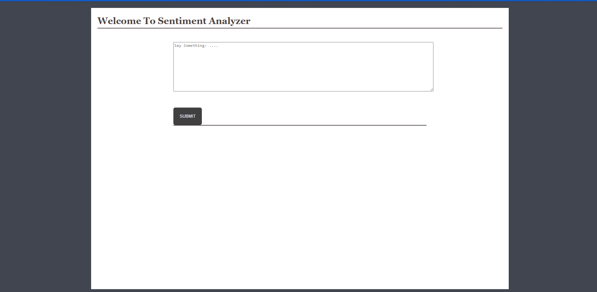

# Tweet Classification App using Docker and Flask

This is the deployment application of my other project, [Sentiment Analysis on COVID19 Tweets](https://github.com/almarengo/COVID_Tweet_Analysis). In particular refer to Notebook 3. 

The app interface was borrowed from [here](https://github.com/Prajwal10031999/Sentiment-Analysis-ML-Flask-App) and slightly changed and adapted to my model.




The app is fully dockerized and ready to run on your local machine or deployed on the cloud. Below are the instructions how to deploy it.

Make sure you have installed:

- Flask
- Sklearn
- Spacy

## ⚙️ Install

Run

``` python
docker build --no-cache -t [my_flask_app_name] .
```

If you are on local machine then run:

``` python
docker run -d -p 5000:5000 [my_flask_app_name]
```

To check the app go on your browers at http://127.0.0.1:5000/

Or if you are deploying it on cluster, run:

``` python
docker run -d -p 80:5000 [my_flask_app_name]
```

In this  case make sure to have allowed inbound HTTP inbound rule (port 80).

To check the app go on your browers at instance-public-dns:80/